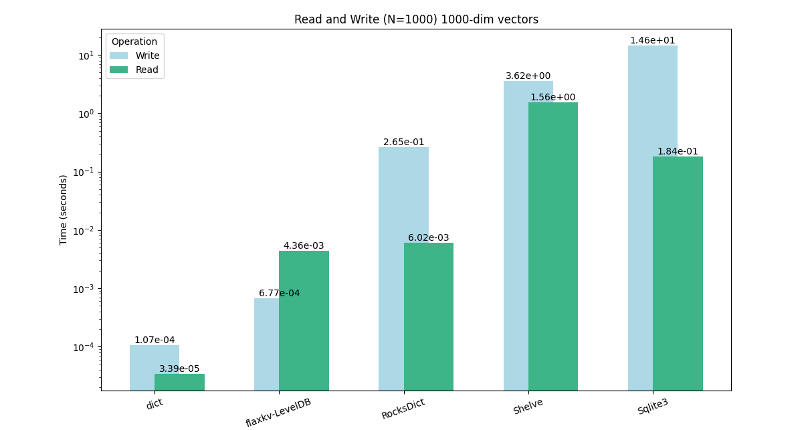

<h1 align="center">
    <br>
    🗲  FlaxKV
</h1>


<p align="center">
A high-performance dictionary database.
</p>
<p align="center">
    <a href="https://pypi.org/project/flaxkv/">
        
    </a>
    <a href="https://github.com/KenyonY/flaxkv/blob/main/LICENSE">
        
    </a>
    <a href="https://github.com/KenyonY/flaxkv/releases">
        
    </a>
    <a href="https://github.com/KenyonY/flaxkv/actions/workflows/ci.yml">
        
    </a>
    <a href="https://pypistats.org/packages/flaxkv">
        
    </a>
</p>

<h4 align="center">
    <p>
        <b>English</b> |
        <a href="https://github.com/KenyonY/flaxkv/blob/main/README_ZH.md">简体中文</a> 
    </p>
</h4>

<p >
<br>
</p>


The `flaxkv` provides an interface very similar to a dictionary for interacting with high-performance key-value databases. More importantly, as a persistent database, it offers performance close to that of native dictionaries (in-memory access).  
You can use it just like a Python dictionary without having to worry about blocking your user process when operating the database at any time.

---

## Key Features

- **Always Up-to-date, Never Blocking**: It was designed from the ground up to ensure that no write operations block the user process, while users can always read the most recently written data.

- **Ease of Use**: Interacting with the database feels just like using a Python dictionary! You don't even have to worry about resource release.

- **Buffered Writing**: Data is buffered and scheduled for write to the database, reducing the overhead of frequent database writes.

- **High-Performance Database Backend**: Uses the high-performance key-value database LevelDB as its default backend.

- **Atomic Operations**: Ensures that write operations are atomic, safeguarding data integrity.

- **Thread-Safety**: Employs only necessary locks to ensure safe concurrent access while balancing performance.

---

## Quick Start

### Installation

```bash
pip install flaxkv 
# Install with server version: pip install flaxkv[server]
```
### Usage

```python
from flaxkv import FlaxKV
import numpy as np
import pandas as pd

db = FlaxKV('test_db')
"""
Or start as a server
>>> flaxkv run --port 8000

Client call:
db = FlaxKV('test_db', root_path_or_url='http://localhost:8000')
"""

db[1] = 1
db[1.1] = 1 / 3
db['key'] = 'value'
db['a dict'] = {'a': 1, 'b': [1, 2, 3]}
db['a list'] = [1, 2, 3, {'a': 1}]
db[(1, 2, 3)] = [1, 2, 3]
db['numpy array'] = np.random.randn(100, 100)
db['df'] = pd.DataFrame({'a': [1, 2, 3], 'b': [4, 5, 6]})

db.setdefault('key', 'value_2')
assert db['key'] == 'value'

db.update({"key1": "value1", "key2": "value2"})

assert 'key2' in db

db.pop("key1")
assert 'key1' not in db

for key, value in db.items():
    print(key, value)

print(len(db))
```

### Tips
- `flaxkv` provides performance close to native dictionary (in-memory) access as a persistent database! (See benchmark below)
- You may have noticed that in the previous example code, `db.close()` was not used to release resources! Because all this will be automatically handled by `flaxkv`. Of course, you can also manually call db.close() to immediately release resources.

### Benchmark


Test Content: Write and read traversal for N numpy array vectors (each vector is 1000-dimensional). 

Execute the test:
```bash
cd benchmark/
pytest -s -v run.py
```


### Use Cases
- **Key-Value Structure:**
Used to save simple key-value structure data.
- **High-Frequency Writing:**
Very suitable for scenarios that require high-frequency insertion/update of data.
- **Machine Learning:**
`flaxkv` is very suitable for saving various large datasets of embeddings, images, texts, and other key-value structures in machine learning.

### Limitations
* In the current version, due to the delayed writing feature, in a multi-process environment, 
one process cannot read the data written by another process in real-time (usually delayed by a few seconds). 
If immediate writing is desired, the .write_immediately() method must be called. 
This limitation does not exist in a single-process environment.
* By default, the value does not support the `Tuple`, `Set` types. If these types are forcibly set, they will be deserialized into a `List`.
 
## Citation
If `FlaxKV` has been helpful to your research, please cite:
```bibtex
@misc{flaxkv,
    title={FlaxKV: An Easy-to-use and High Performance Key-Value Database Solution},
    author={K.Y},
    howpublished = {\url{https://github.com/KenyonY/flaxkv}},
    year={2023}
}
```

## Contributions
Feel free to make contributions to this module by submitting pull requests or raising issues in the repository.

## License
`FlaxKV` is licensed under the [Apache-2.0 License](./LICENSE).


