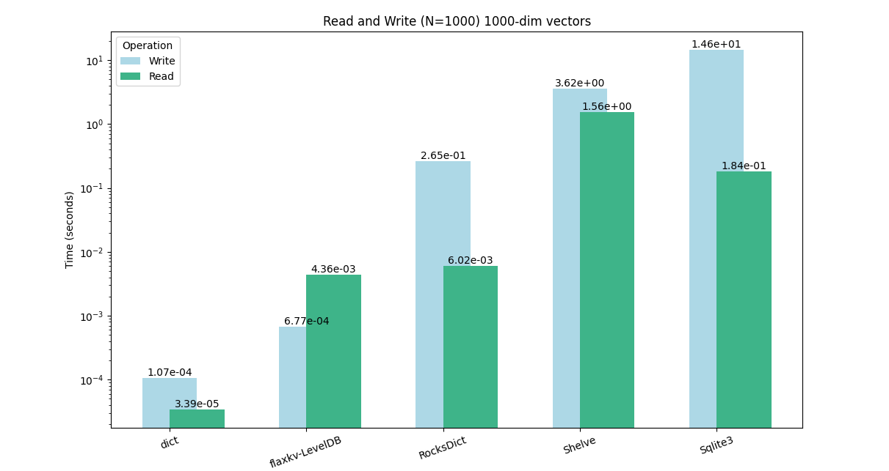

<h1 align="center">
    <br>
    🗲  FlaxKV
</h1>

<p align="center">
一个高性能字典数据库
</p>


<p align="center">
    <a href="https://pypi.org/project/flaxkv/">
        
    </a>
    <a href="https://github.com/KenyonY/flaxkv/blob/main/LICENSE">
        
    </a>
    <a href="https://github.com/KenyonY/flaxkv/releases">
        
    </a>
    <a href="https://github.com/KenyonY/flaxkv/actions/workflows/ci.yml">
        
    </a>
    <a href="https://pypistats.org/packages/flaxkv">
        
    </a>
</p>

<h4 align="center">
    <p>
        <b>简体中文</b> |
        <a href="https://github.com/KenyonY/flaxkv/blob/main/README.md">English</a> 
    </p>
</h4>

<p >
<br>
</p>


`flaxkv` 提供了一个非常类似字典的接口，用于与高性能键值数据库进行交互。更重要的是，它作为持久化数据库提供了接近原生字典(内存)的写入性能。
你可以直接将它当成python字典来使用而不必担心在任何时候操作数据库时会阻塞你的用户进程。

---

## 主要特征

- **保持最新,永不阻塞**：它被设计的初衷便是不让任何写入操作阻塞用户进程，同时用户永远可以读取到最新写入的数据。

- **易于使用**：与数据库交互，就像使用 Python 字典一样！你甚至不用关心它的资源释放

- **缓冲写入**：数据将被缓冲写入及计划写入数据库，减少数据库频繁写入的开销。

- **高性能数据库后端**: 使用高性能键值数据库 LevelDB 作为默认后端。

- **原子操作**：确保写入操作是原子的，保证数据完整性。

- **线程安全**：仅使用必要的锁来确保安全的并发访问同时又能兼顾性能。


---

## 快速入门

### 安装
```bash
pip install flaxkv
# 安装带服务端版本：pip install flaxkv[server]
```

### 使用

```python
from flaxkv import FlaxKV
import numpy as np
import pandas as pd

db = FlaxKV('test_db')

"""
或者作为服务端启动
>>> flaxkv run --port 8000

客户端调用:
db = FlaxKV('test_db', root_path_or_url='http://localhost:8000')
"""

db[1] = 1
db[1.1] = 1 / 3
db['key'] = 'value'
db['a dict'] = {'a': 1, 'b': [1, 2, 3]}
db['a list'] = [1, 2, 3, {'a': 1}]
db[(1, 2, 3)] = [1, 2, 3]
db['numpy array'] = np.random.randn(100, 100)
db['df'] = pd.DataFrame({'a': [1, 2, 3], 'b': [4, 5, 6]})

db.setdefault('key', 'value_2')
assert db['key'] == 'value'

db.update({"key1": "value1", "key2": "value2"})

assert 'key2' in db

db.pop("key1")
assert 'key1' not in db

for key, value in db.items():
  print(key, value)

print(len(db))
```


### Tips

- `flaxkv`作为持久化数据库提供了接近原生字典(内存)存取的性能！(见下文benchmark)
- 也许你注意到在前面的示例代码中并没有使用到`db.close()`来进行资源释放！因为这一切都将被`flaxkv`自动处理。 当然也可以手动调用 `db.close()` 来立即释放资源

### Benchmark


测试内容：对N条1000维的numpy array进行写入和遍历读取

执行测试:
```bash
cd benchmark/
pytest -s -v run.py
```

### 适用场景

- **键-值型结构**：
  适用于保存简单的键值结构数据
- **高频写入**：
  适合需要高频插入/更新数据的场景
- **机器学习**：
  适用于保存机器学习中的各种嵌入向量、图像、文本和其它键-值结构的大型数据集。


## 引用
如果`FlaxKV`对你的研究有帮助，欢迎引用：
```bibtex
@misc{flaxkv,
    title={FlaxKV: An Easy-to-use and High Performance Key-Value Database Solution},
    author={K.Y},
    howpublished = {\url{https://github.com/KenyonY/flaxkv}},
    year={2023}
}
```

## 贡献
欢迎通过提交拉取请求或在仓库中提出问题来为此模块做出贡献。

## License
`FlaxKV`遵循[Apache-2.0开源协议](./LICENSE)
